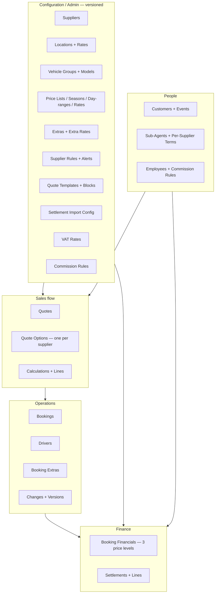
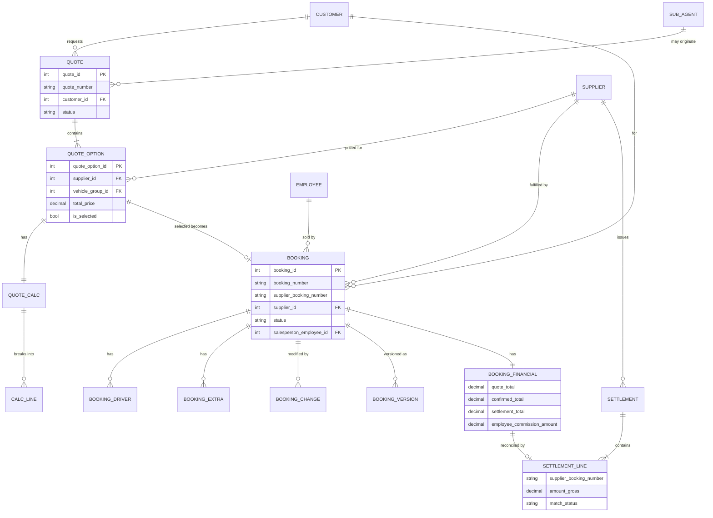
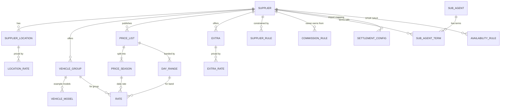
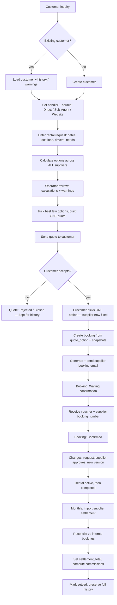
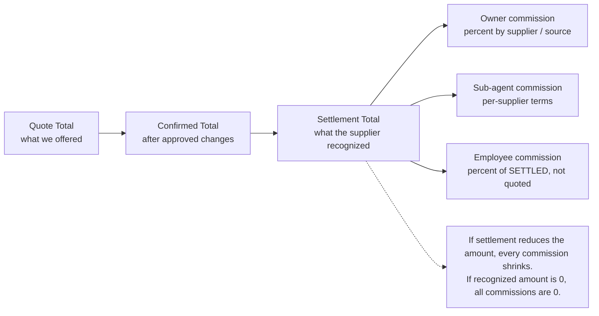
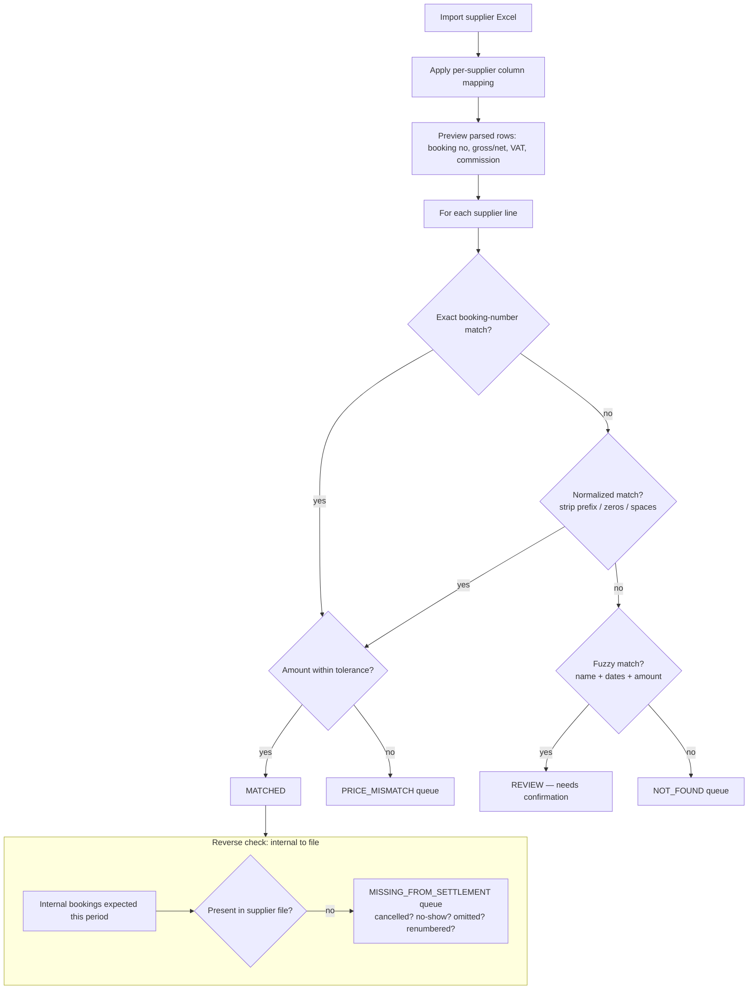
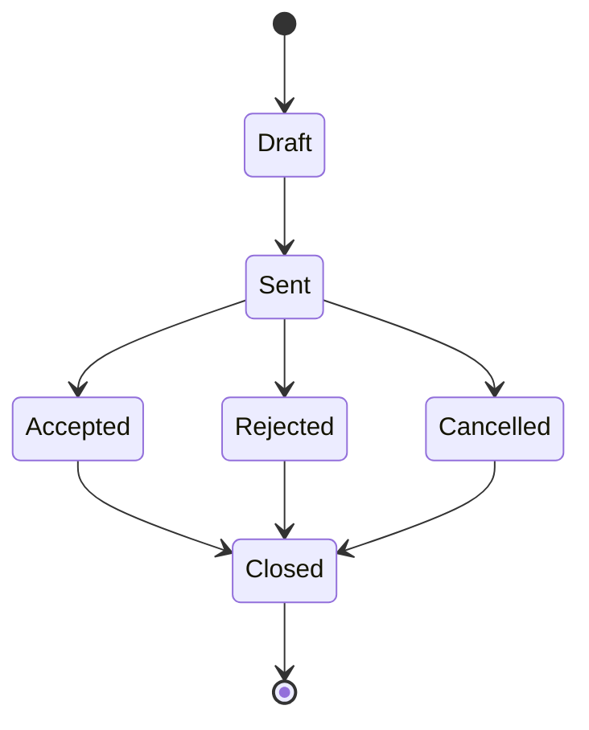
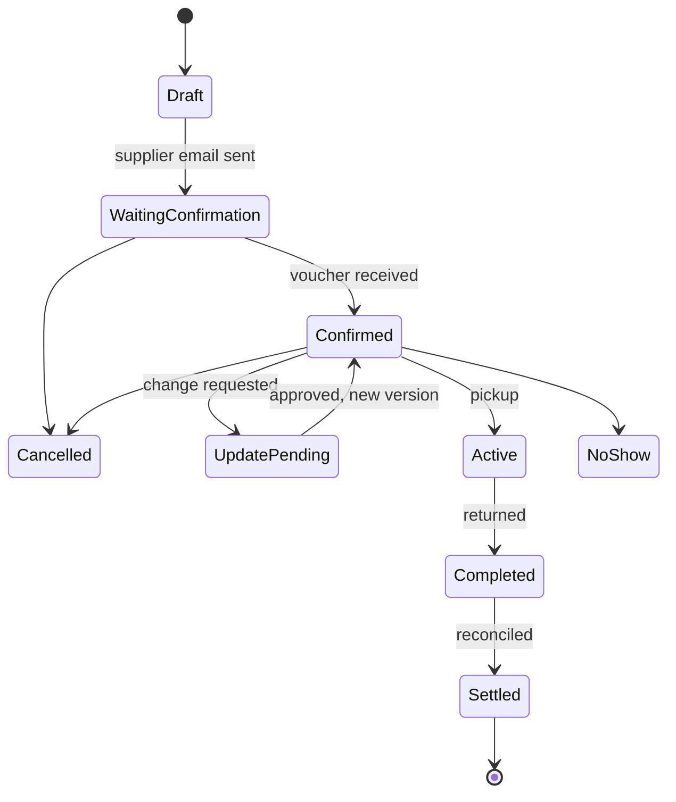

# Idan Rent a Car — Architecture & Build Roadmap

> **What this document is.** A navigable, diagram-driven architecture built *on top of* Idan's
> detailed spec (`system-architecture-summary.md`, in this same folder). His document remains the
> exhaustive, field-by-field source of truth. **This document is the map**: it shows how the
> pieces fit, why the key decisions are right, how the money flows, and — critically — the
> **order** in which a solo builder should build it so each step leaves something usable.
>
> **Two lenses of diagrams:**
> - **His understanding** — the full domain: data model, end-to-end workflow, status machines.
> - **Our overlay** — how to build and review it: the money path, the reconciliation ladder,
>   and the incremental milestone roadmap.
>
> **How to read the diagrams.** These are [Mermaid](https://mermaid.js.org/) diagrams. They
> render automatically on GitHub, and in VS Code with the *Markdown Preview Mermaid Support*
> extension.

---

## 1. Guiding principles (kept from Idan's design)

These are the load-bearing decisions. They are correct and should survive the whole build.

1. **Configuration over hardcoding.** Suppliers, prices, rules, VAT, templates, statuses, and
   numbering are editable data — adding a supplier never requires code changes.
2. **Versioning + snapshots.** Quotes and bookings store a *snapshot* of the prices, rules, and
   commission terms that applied when they were created. Changing today's rules never rewrites
   history.
3. **Audit trail.** Manual discounts, overrides, and changes are explicit, logged records —
   never silent edits to a total.
4. **One quote, many suppliers.** A quote is supplier-independent; the supplier lives on each
   *option*. A single supplier is chosen only when the customer picks one option.
5. **Three price levels.** Quote Total → Confirmed Total → Settlement Total. This is what makes
   reconciliation and commissions correct.
6. **Operator-first.** The system calculates, warns, and validates — it never auto-selects a
   supplier or auto-sells. Human judgement stays in control.

---

## 2. Domain map — orientation *(his understanding)*

The whole system at a glance: five clusters and how they feed each other. Configuration and
People feed the Sales flow; Sales produces Operations; Operations produce Finance.

---

## 3. Data model

### 3.1 Transactional spine *(his understanding)*

The core life of a deal: a customer's quote holds several supplier options; the chosen option
becomes a booking; the booking carries drivers, extras, changes, versions, and one financial
record that is later reconciled by a settlement line.

### 3.2 Configuration / supplier side *(his understanding)*

Everything the pricing engine reads. Note two deliberate shapes: **locations are per-supplier**
(the same airport exists once per company), and **rates are the intersection** of season ×
vehicle group × day-range.

> **Full field lists** for every entity live in Idan's spec. This document intentionally shows
> only keys and the fields that matter for understanding relationships.

---

## 4. End-to-end workflow *(his understanding)*

The corrected lifecycle. The pivotal moment is **"customer picks ONE option → supplier is now
fixed"** — before that, the deal is genuinely multi-supplier.

---

## 5. The money model *(our overlay — the review-critical part)*

This is where a wrong formula quietly costs real money, so it gets its own diagram. Three
price levels flow left to right; **commissions are always computed off the *settled* amount**,
not the quoted one.

**Worked example (from the spec).** Gross 10,000 PLN, owner 12%, employee 4% → owner 1,200,
employee 400. If settlement later recognizes only 8,000 → employee 320. If 0 → employee 0.

**Review checklist for this area (the four things to verify):**
- Quote / Confirmed / Settlement totals are stored **separately**, never overwritten into one.
- Commission basis is the **settled** amount, and commission rules are **versioned/snapshotted**.
- Gross/Net normalization is correct per supplier (see §6).
- Owner, sub-agent, and employee commissions are **independent** calculations.

---

## 6. Reconciliation — the matching ladder *(our overlay — the core feature)*

This is the reason the system exists. Matching must be a **ladder** (exact → normalized →
fuzzy → manual) and must run **in both directions**. Start by building only the top of the
ladder plus a good review queue; add the lower rungs as real supplier files reveal the mess.

**Gross / Net rule.** If the comparison column is Gross, use it directly. If Net,
`Gross = Net × (1 + applicable VAT)` using the versioned VAT rate. Preserve the raw supplier
row (`raw_data`) always. Re-importing the same or a corrected file must be **idempotent**
(dedupe on settlement line + re-match), which the spec should make explicit.

---

## 7. Status machines *(his understanding)*

### 7.1 Quote

### 7.2 Booking

The rule that matters: **a booking stays at its last supplier-confirmed state until a change
is approved** — pending changes are shown separately and only applied (as a new version) on
approval.

### 7.3 Settlement line match state

`MATCHED` · `PRICE_MISMATCH` · `NOT_FOUND` · `DUPLICATE` · `REVIEW` · `MISSING_FROM_SETTLEMENT`
— see the ladder in §6.

---

## 8. Build roadmap — milestones *(our overlay)*

Nothing is cut: the full design still arrives. This is only the **order**, chosen so that
(a) dependencies are respected, (b) the Excel pain dies early, and (c) the money features get
their own milestones where the supervisor reviews.

```mermaid
flowchart LR
    M0["M0 Foundations"] --> M1["M1 Booking register<br/>replace Excel"]
    M1 --> M2["M2 Quotes + pricing engine"]
    M2 --> M3["M3 Financials + commissions"]
    M3 --> M4["M4 Settlement + reconciliation"]
    M4 --> M5["M5 Changes + versions"]
    M5 --> M6["M6 Sub-agents"]
    M6 --> M7["M7 Rules / alerts / templates"]
    M7 --> M8["M8 Go-live: dashboard, permissions, backup"]

    classDef big fill:#ffe0b2,stroke:#e65100,color:#000;
    classDef gate fill:#e1f5fe,stroke:#0277bd,color:#000;
    class M2,M4 big;
    class M3,M8 gate;
```

*(Orange = the two big jumps. Blue = supervisor review gate. M2 and M4 are both — big jumps
**and** financial review gates.)*

| # | Milestone | Usable outcome | Jump | Review |
|---|-----------|----------------|------|--------|
| **M0** | Foundations: customers, suppliers, employees, vehicle groups, locations, VAT, numbering, login | Core data stored; the spine | Small | Light |
| **M1** | Central booking register (drivers, extras, statuses, views) — **price typed manually** | **Stop using the 3 Excel files** | Small–med | Light |
| **M2** | Quotes + pricing engine (price lists→seasons→bands→rates, extras, multi-supplier options, calc lines); accepted quote → booking | In-system quoting, auto-calculated, no retyping | **Big** | 🔵 financial |
| **M3** | Financials + commissions (3 levels, owner/sub-agent/employee, creator vs salesperson) | Every booking tracks totals + who earns what | Medium | 🔵🔵 financial |
| **M4** | Settlement + reconciliation (import config, gross/net/VAT, exact-match + review queue) | Monthly files reconciled; commissions on settled amounts | **Big** | 🔵🔵 financial |
| **M5** | Booking changes + versions (pending vs confirmed, audit log) | Controlled changes, full history | Medium | Light–med |
| **M6** | Sub-agents (per-supplier terms, commission, phone fallback) | Sub-agent bookings with their own terms | Medium | 🔵 financial |
| **M7** | Rules, alerts, quote & email templates | Configurable warnings + polished quotes/emails | Medium | Light |
| **M8** | Go-live: dashboard, permissions, cloud backup + export, migration cutover | Team access, backups, real launch | Medium | 🔵 security |

**Notes for the builder:**
- **M1's manual price field is deliberately temporary** — M2 replaces it. Cheap, buys weeks of early value.
- **M4 vs M5 order is flexible** — settlement is placed first for value; swap if change-tracking is more urgent.
- **M7 is polish, built late on purpose** — the configurable rule/template layers don't block any valuable milestone, so if time runs short this is the safe place to slip.

---

## 9. What lives in Admin (configurable, no code changes)

Suppliers · contacts · locations · location rates · vehicle groups · models · price lists ·
seasons · day-ranges · daily rates · extras · extra rates · STOP SALE · supplier rules ·
customer alerts · sub-agents · sub-agent×supplier terms · employees · employee commission
rules · owner/supplier commission rules · VAT rates · quote templates · template blocks ·
supplier email templates · settlement mappings · statuses · booking numbering · languages ·
permissions.

---

## 10. Open items to resolve during implementation

Carried from Idan's spec — none are architectural blockers:

- Exact internal booking-number format and per-sub-agent prefixes.
- Which supplier rules **hard-block** vs **warn** (and the surcharge formulas).
- Settlement matching **tolerance** semantics (absolute vs percentage; rounding).
- Re-import / idempotency behaviour for corrected settlement files.
- Exact per-language quote content and per-supplier email layouts.
- Full permissions matrix.
- Scope of the first Excel migration/import.
- Multi-currency handling (if any supplier settles in non-PLN).

---

## Appendix — how this maps to Idan's spec

| This document | Idan's spec sections |
|---|---|
| §2 Domain map | 4, 64, 65 |
| §3.1 Transactional spine | 27–34, 38–50 |
| §3.2 Config / supplier side | 7–24, 51, 56, 58 |
| §4 Workflow | 3, 63 |
| §5 Money model | 49–52, 57 |
| §6 Reconciliation | 53–58 |
| §7 Status machines | 27, 45, 55 |
| §8 Roadmap | *(our addition — not in the spec)* |
| §9 Admin config | 65 |
| §10 Open items | 67 |
